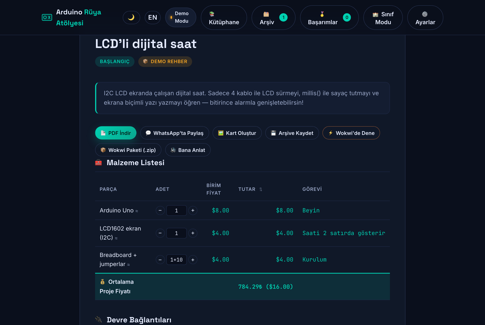

# 🤖 Arduino Rüya Atölyesi

**[🚀 Canlı Demo](https://proacademycomtr.github.io/arduino-ruya-atolyesi/)** — kurulum yok, tarayıcıda aç ve kullan. API anahtarı olmadan da 14 demo rehberle çalışır.

Katkı yapmak isterseniz [CONTRIBUTING.md](CONTRIBUTING.md) ile başlayın; yayına çıkarmak için `./publish.sh` tek komut.

> 🗄️ **Üyelik, ücretsiz/$1 kontenjan, topluluk duvarı, arama, moderasyon** (v4.4.0) — API: [server/](server/) (Node + Express + Prisma + PostgreSQL). Kurulum, Stripe ve VDS dağıtımı: **[SUNUCU.md](SUNUCU.md)**.
> 👤 Başlıktaki **Giriş** ve **🌍 Duvar** düğmeleri API adresi tanımlıysa çalışır. `API_BASE` boşken (GitHub Pages) **hiçbir ağ isteği atılmaz**, uygulama eskisi gibi yalnız demo modda çalışır.

    [](https://github.com/proacademycomtr/arduino-ruya-atolyesi/actions/workflows/test.yml)

> 🎨 **Kart Oluştur** düğmesiyle her rehberden paylaşılabilir proje kartı (PNG) çıkar — README'ye eklemek istediğin kartı bize söyle, buraya koyalım.



Öğrenciler için **yapay zekâ destekli Arduino proje rehberi**. Hayalindeki projeyi bir cümleyle yaz; yapay zekâ sana **malzeme listesi**, **devre bağlantıları**, **adım adım yapım rehberi**, **güvenlik ipuçları** ve **çalışan Arduino kodu** hazırlasın.

## ✨ Özellikler

- 💬 Doğal dille proje fikri girişi (örn. *"otomatik sulayan akıllı saksı yapabilir miyim?"*)
- 🧰 Malzeme listesi + parça görevleri
- 🔌 Pin bağlantı tablosu
- 🛠️ Adım adım yapım rehberi (ipuçlarıyla)
- 💻 Kopyala-yapıştır hazır Arduino kodu
- ⚡ **Wokwi'de Dene:** rehberdeki kodu tek tıkla panoya alıp [Wokwi](https://wokwi.com) simülatöründe çalıştır — donanım almadan dene
- 🧩 **Wokwi Devre Taslağı:** malzeme listesinden tahmin edilen parçalar **+ rehberdeki bağlantı tablosundan üretilen gerçek kablolar** (`connections`) ile `diagram.json` çıkarır; kopyalarken kaç parça/kablo üretildiğini ve eşleşmeyen satırları özet olarak bildirir
- 🔎 **Taslak doğrulama (wokwiValidate):** taslağı üretirken **pin çakışması** (aynı pine iki kablo) ve **eksik GND/5V besleme** uyarılarını öğretici kutuda gösterir — öğrenciler kabloyu çekmeden hatayı görür
- 📦 **Wokwi Paketi (.zip):** rehberden `sketch.ino` + `diagram.json` + öğretmen notları içeren **gerçek bir proje arşivi** indirir — öğrenci adı ve sınıf kodu biliniyorsa **sketch başlığı ve notlar kişiselleşir** — Wokwi'de "Open project ZIP" ile tek seferde açılır (bağımlılıksız zip yazıcı)
- 🛠️ **Adım takibi:** her adımın yanında onay kutusu + ilerleme çubuğu; tüm adımlar bitince sertifika satırı açılır (ilerleme localStorage'da kalıcı)
- 🏫 **Sınıf Modu + Öğretmen Paneli:** öğretmen sınıf kodu üretir ve paylaşır; öğrenci adımlarını tamamlayıp **`.klasor.json` gönderim dosyası** indirir; öğretmen **iki sütunlu panelde** gönderileri ilerleme yüzdesiyle izler, yorum yazar, **PDF sınıf raporu** (SVG lider tablosu + 📈 haftalık ilerleme grafiği + 🎯 sınıf bütçe planı) alır — 🏫 **çoklu sınıf seçici** ile CSV/rapor sınıfa göre süzülür, 📈 **canlı haftalık grafik** panelde anında görünür — tamamı sunucusuz, dosya tabanlı akış. Panel akıllıdır: 🏷️ **katalog öneri çipleri** (depoda olup özel fiyatı olmayan parçalar tek tıkla fiyat listesine eklenir), 🚨 **risk altındaki öğrenciler** (10 gündür hareketsiz + bitmemiş proje), ❓ **fiyatlanamayan malzemeler** (kataloksız parçalar toplanır), 📊 **CSV dışa aktarma** (Excel uyumlu gönderi tablosu) ve 🔍 **arama + sayfalama** (Türkçe harf duyarsız, 6'şarlı); 📅 **CSV tarih filtresi** (dönem sonu raporu için gönderileri başlangıç/bitiş gününe göre süzer — CSV, liste ve PDF raporu birlikte) + 🕒 **Son Etkinlik sütunu** (öğrenci başına en son adım günü)
- 🏅 **Öğrenci başarımları:** header'daki sayaçlı düğme; kazanılan **sertifikalar** + okunan **öğretmen geri bildirimleri** tek yerde
- 🥉🥈🥇 **Rozet kademeleri:** Başarımlar penceresinde bronz (3 sertifika) / gümüş (5) / altın (tüm 14 demo) ilerleme kartı + "sonraki hedef" göstergesi
- 📦 **Portfolyo.zip:** sertifikalı tüm rehberlerin Wokwi paketleri (sketch.ino + diagram.json + notlar + **sertifika SVG'si**) numaralı klasörlerle tek arşivde; kökte PORTFOLYO.txt özeti; ⭐ favoriler öne alınır, **RAPOR.md** favori/etiket özetini taşır
- ⭐ **Arşiv favori + etiketler:** arşiv kartlarında favorile ⭐ ve virgülle ayırarak etiketle 🏷️; çiplerle filtrele (Tümü / Favoriler / etiket), favoriler Portfolyo.zip'te öne çıkar; 🔍 **arama kutusu** başlık/fikir/etikette Türkçe harf duyarsız süzer; 🔃 **sıralama** (En yeni / Favoriler önce / A→Z) ve kartlarda son açılış günü (🔓)
- 🚀 **İleri Seviye:** demo rehberlerde katlanabilir gelişmiş kutu — ek devre + kod parçaları (multiplexing, kayıt/çalma, oktav kontrolü)
- 💬 **Öğretmen geri bildirimi:** öğretmen içe aktarılan gönderiye yorum yazar, `.geribildirim.json` dosyası indirip öğrenciye iletir; öğrenci rehberde **"Geri Bildirimi Göster"** ile okur — döngü tamamen dosya tabanlı
- 🏆 **Lider tablosu:** sınıf raporunda öğrenciler ilerleme yüzdesine göre sıralı SVG çubuk grafikte (ilk 10) gösterilir; raporda ayrıca her gönderimin **Geri Bildirim** durumu (Verildi ✓ / Bekliyor + yorum özeti) listelenir
- 💰 **Malzeme fiyat tahmini:** malzeme tablosunda Birim Fiyat / Tutar sütunları ve **Ortalama Proje Fiyatı** toplamı — 39 parçalık yaklaşık perakende kataloğundan ₺ + $ çift gösterim; 💱 **çevrimiçi kur güncelleme** (exchangerate.host; açılışta 24 saatten eskiyse otomatik tazelenir); ⌨️ fikir yazarken **canlı maliyet ipucu** — API anahtarı varsa ✨ **AI gerçek parça listesiyle tahmin** yapar, yoksa demo şablonuna düşer; 💡 bütçe aşımında **Nano önerisi**; 📁 **fiyat-katalogu.json** depoda varsayılan katalog — öncelik: öğretmen özel → depo → gömülü. Detaylar için [SÜRÜM_NOTLARI.md](SÜRÜM_NOTLARI.md)
- 🛒 **Alışveriş listesi:** rehber aksiyonlarından tek tıkla WhatsApp'a hazır — "parça × adet — satır toplamı" satırları ve proje toplamıyla; adet düzenleyicindeki değişiklikler listeye yansır, popup engellenirse panoya kopyalanır
- 🏷️ **Öğretmen fiyat kataloğu:** Ayarlar'da "Parça adı: fiyat" satırlarıyla okulun kendi fiyatları tanımlanır, katalogu override eder (✏️ işaretiyle); 📤 **JSON dışa/içe aktarımla** diğer öğretmenlerle paylaşılır ve **Portfolyo.zip'e fiyat-katalogu.json olarak gömülür**; 🎯 **bütçe sınırı** aşılırsa tabloda ⚠️ kırmızı uyarı + sertifikada kırmızı şerit + sınıf raporunda aşım işareti; 🔢 **canlı adet düzenleyici** (−/+ ve yazılabilir kutu) ile toplam anında güncellenir; 🔽 **fiyata göre sıralama** düğmesi; sınıf raporunda **Maliyet sütunu + sınıf toplam bütçesi**, Portfolyo.zip'te **bütçe özeti + toplam**; 💱 fiyatlar **₺ ana, $ ikincil** gösterilir ve sertifikada altın şerit taşınır
- 📚 **Bileşen kütüphanesi:** 15 parça; pinleri, örnek kodu, sık yapılan hataları ve gerçek Wokwi parça tipleriyle
- ⭐ **Özel bileşen seti:** öğretmenler kendi bileşenlerini ekler, **JSON olarak dışa/içe aktarır** (sınıfla paylaşım); set localStorage'da kalıcıdır ve Wokwi üretiminde otomatik kullanılır
- 🎤 **Sesli fikir girişi:** mikrofonla konuş, fikrin metne dönüşsün (Chrome/Edge)
- 🔊 **Bana Anlat / 👁️ Göz Serbest:** rehberi sesli okur (metinden konuşmaya) — v2.20.0 ile **adım adım okur, her adımı otomatik işaretler ve sonrakine geçer**; öğrenci elini kullanmadan rehberi takip eder, işaretli adımlardan kaldığı yerden devam eder
- 🏅 **Başarı sertifikası:** tüm adımları tamamlayınca adını yazıp sertifika oluştur — **PDF olarak otomatik iner**, yazdırılabilir pencere de açılır
- 🖼️ **Paylaşım kartı:** rehberi 1080×1080 sosyal medya kartı olarak indir; mobilde **Web Share API** ile doğrudan Instagram/WhatsApp'a paylaş — **sertifika penceresinden de tek tıkla PNG**
- 📲 **PWA / Çevrimdışı:** manifest + service worker ile site telefona kurulur, internet olmadan da açılır (AI çağrıları hariç — onlar bağlantı ister)
- 📦 **Demo modu:** API anahtarı olmadan da çalışır (14 hazır örnek rehber — çizgi izleyen, saksı, termostat, güvenlik, robot kol, 7 segment sayaç, park sensörü, mini piyano, LCD dijital saat, RGB mood lambası, servo kapı kilidi, gece lambası, dijital zar, OLED mesafe ölçer — hepsi gerçek Wokwi kablolama ipuçlarıyla)
- ⚡ **Toplu geri bildirim:** öğretmen panelinde yorumu bekleyen gönderiler tek listede; tek tıkla tümü kişisel `.geribildirim.json` olarak iner
- 💾 **Veri yedeği:** tüm uygulama verisi (arşiv, adımlar, sınıf, rozetler, geri bildirimler, özel bileşenler) tek `.yedek.json` dosyasıyla taşınır — Ayarlar'dan dışa/içe aktarma
- 🔐 API anahtarı **yalnızca tarayıcında** saklanır (localStorage), hiçbir sunucuya gitmez

## 🚀 Çalıştırma

Statik bir sayfadır — kurulum gerekmez:

```bash
# Herhangi bir yöntemle açabilirsin:
# 1) Dosyayı tarayıcıda aç (index.html'e çift tıkla)
# 2) veya küçük bir sunucu ile:
python3 -m http.server 8000
# sonra http://localhost:8000 adresine git
```

## 🧪 Testler

Çözücü, Wokwi diyagram/validasyon, zip yazıcı ve sınıf gönderimi birim testleri (Node ≥ 18, bağımlılıksız):

```bash
node --test tests/
```

## 🌐 GitHub Pages ile Ücretsiz Yayına Alma

Site tamamen statik olduğu için GitHub Pages'te ücretsiz yayınlanır:

1. **Depoyu GitHub'a gönder** (öğrenciler için en kolayı):
   ```bash
   git init && git add . && git commit -m "Arduino Rüya Atölyesi"
   git branch -M main
   git remote add origin https://github.com/KULLANICI_ADIN/arduino-ruya-atolyesi.git
   git push -u origin main
   ```
2. GitHub'da **Settings → Pages**'a git.
3. "Build and deployment → Source" kısmından **Deploy from a branch** seç.
4. Branch: **main**, klasör: **/(root)** seç ve **Save**'e bas.
5. 1-2 dakika içinde `https://KULLANICI_ADIN.github.io/arduino-ruya-atolyesi/` adresinde site canlı olur.

> 💡 **API anahtarı gerektiği için** siteyi sadece kendi kullanımın ya da sınıf içi kullanım için paylaş.
> İstersen `KULLANICI_ADIN.github.io` deposuna koyup kişisel vitrin yapabilirsin.
>
> ⚠️ **Not:** GitHub Pages HTTPS sunar; **Özel (Ollama)** sağlayıcısı için localhost adresi gerektiğinde sayfayı yerel dosya olarak açmak gerekir.

## 🔑 Gerçek Yapay Zekâyı Etkinleştirme

Site anahtar girilene kadar **Demo Modu** ile çalışır. Gerçek AI için:

1. Sağ üstteki **⚙️ Ayarlar** düğmesine tıkla.
2. Sağlayıcı seç (Google Gemini ya da OpenAI) ve API anahtarını yapıştır.
3. Kaydet — üstteki durum rozeti "Bağlı"ya döner.

| Sağlayıcı | Anahtar adresi | Kullanılan model |
|-----------|----------------|------------------|
| Google Gemini | https://aistudio.google.com/apikey | `gemini-2.0-flash` |
| OpenAI | https://platform.openai.com/api-keys | `gpt-4o-mini` |

> 💡 Gemini'nin ücretsiz kotası öğrenci projeleri için gayet yeterli.

## 📁 Dosyalar

Proje **klasik üç dosya yapısında** — düzenlemesi kolay, dağıtımı tek komut:

| Dosya | Amaç |
|-------|------|
| `index.html` | Sayfa yapısı (stiller ve betik `style.css` + `app.js`'ten gelir) |
| `style.css` | Tüm stiller (tema, kartlar, modallar, sertifika, şema) |
| `app.js` | Uygulama mantığı (AI çağrıları, rehber, arşiv, ses, sertifika) |
| `build.py` | Üç dosyayı tek dosyalık `dist/index.html`'e derler; sürüm yönetimi + CHANGELOG.md otomasyonu + PWA dosyalarını dist'e kopyalar |
| `dist/index.html` | **Tek dosyalık dağıtım sürümü** — GitHub Pages için ideal |
| `dist/manifest.json`, `dist/sw.js`, `dist/icon.svg` | PWA dosyaları (derleme sırasında dist'e kopyalanır) |
| `CHANGELOG.md` | Sürüm geçmişi (`build.py` tarafından otomatik güncellenir) |
| `README.md` | Bu kılavuz |


## 🧠 Nasıl Çalışır?

`app.js` içindeki `PROMPT_TEMPLATE`, yapay zekâdan katı bir JSON şemasıyla rehber üretmesini ister
(başlık, zorluk, malzemeler, bağlantılar, adımlar, ipuçları, kod). Yanıt ayrıştırılıp doğrulanır
ve sayfanın "sonuç" bölümüne render edilir. Demo modu, anahtar yoksa aynı şemadaki hazır
örnek rehberlerden birini gösterir.

## 📲 PWA / Çevrimdışı Kullanım

- `python3 build.py` çalıştırınca `dist/` içine `manifest.json`, `sw.js` ve `icon.svg` de kopyalanır.
- Siteyi HTTPS üzerinden (ör. GitHub Pages) açan öğrenci, tarayıcı menüsünden **"Ana ekrana ekle / Uygulamayı yükle"** diyerek siteyi telefonuna kurabilir.
- Service worker app shell'i önbelleğe alır: ikinci açılış ve çevrimdışı durumda rehberler, arşiv ve kütüphane çalışmaya devam eder. Yalnızca **AI çağrıları ve Wokwi** bağlantı ister.
- Kaynak sürümü (`index.html` + `app.js`) doğrudan açarken service worker devreye girmez; PWA özellikleri `dist/` sürümü içindir.

## ⚠️ Güvenlik Notu

API anahtarını **asla** kodun içine yazma ve GitHub'a yükleme. Bu proje anahtarı yalnızca
tarayıcının `localStorage`'ında tutar; ama tarayıcı eklentileri/ortak bilgisayarlar risk
oluşturabilir. Sınıf/okul çapında kurulumda anahtarın sunucu tarafında tutulduğu bir proxy
katmanı eklemek en güvenlisi olur.
